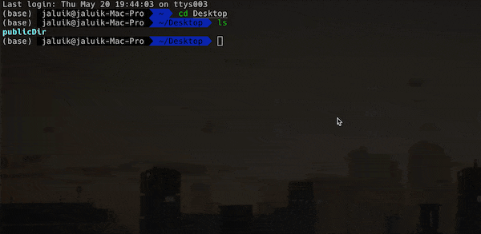

# tinypng-go

[English](README.md) | 中文

用于使用 tinypng 批量快速压缩图片的命令行工具

- 图片不失真下，压缩效率达 50% - 70%
- 支持递归压缩文件夹中的所有图片
- 支持批量替换或导出压缩后的图片文件
- 支持避免重复压缩
- 支持压缩结果展示

## 快速开始

```sh
tinypng-go images  # 压缩images文件夹下的图片并整体替换
tinypng-go logo.png -o logo-new.png  # 压缩logo.png图片后导出到logo-new.png文件（原图不变）
tinypng-go images -o imagesDir # 压缩images文件夹下的所有图片文件后导出到imagesDir文件夹（原图不变，新目录保持同样的图片文件结构）
```



## 安装

使用 npx 或全局安装

### npx

```sh
npx tinypng-go <filename or dirname> [OPTIONS]
```

### 全局安装

#### npm

```
npm install -g tinypng-go
```

#### yarn

```
yarn global add tinypng-go
```

查看是否安装成功

```
tinypng-go -v
```

## 使用方法

`tinypng-go <filename or directory> [OPTIONS]`

```
-v, --version          显示当前版本号
-o, --output <output>  指定输出的文件夹目录或图片名称
-m, --max [max]        同时压缩处理的最大任务数（值越大速度越快）
-a, --all              如指定次参数，则之前使用命令行压缩过的图片还会再次压缩（默认策略是不会重复压缩）
-h, --help             查看帮助信息
```

** -m 指定了同时处理的任务数，可以设值大一些（会消耗更多内存） **

### 使用案例

```sh
tinypng-go images  # 压缩images文件夹下的图片并替换
tinypng-go logo.png -o logo-new.png  # 压缩logo.png图片后导出到logo-new.png文件（原图不变）
tinypng-go images -o imagesDir # 压缩images文件夹下的所有图片文件后导出到imagesDir文件夹（原图不变，新目录保持同样的图片文件结构）
tinypng-go images  -m  30 # 压缩images文件夹下的图片并替换，最大任务数为30
```
